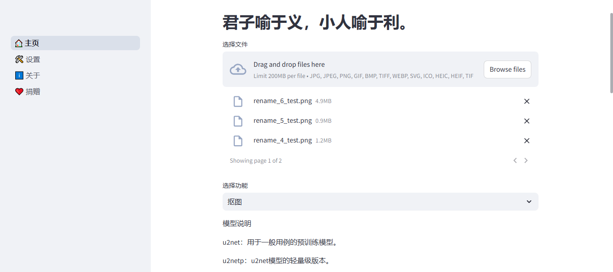

<div align=center>


<h1>DaYe PhotoStudio-2</h1>

<a href="https://dyblog.online/"></a>


<h3>完全开源免费的图像处理软件！</h3>
</div>

## 🎨 运行截图 GUI


<details>
<summary>
功能列表 🧾
</summary>

- [x] 扣图
- [x] 图片压缩
- [ ] 表格识别
- [ ] 清晰放大
- [x] 位图转矢量
- [x] 修改尺寸
- [ ] 批量重命名
- [x] 格式转换
- [x] 拆分GIF
- [x] 合成GIF
- [ ] 批量打印
- [x] 图片拼接
- [x] 图像旋转
- [x] 圆角裁剪

</details>

## 🖥 支持的操作系统

- Windows 10,11


## 📦 下载
<a href="https://pan.quark.cn/s/b42aabae0e5f"></img></a>

## 本地运行
首先确保你的电脑上已经安装了Python3.8+

克隆仓库：
```
  git clone https://github.com/darkmatter2048/DaYePhotoStudio-2.git
```

安装依赖：
```
  pip install -r requirements.txt
```

运行，稍后会使用默认浏览器弹出一个新页面：
```
  python launcher.py
```

## 📦 打包

这里推荐使用 uv 创建虚拟环境，然后安装依赖，最后使用 PyInstaller 打包。

安装 uv：
```
  pip install uv
```

激活虚拟环境：
```
  uv venv
  .venv\Scripts\activate
```
安装依赖及 PyInstaller：
```
  uv pip install -r requirements.txt -U pyinstaller
```

编译：
```
  uv run pyinstaller -D -i icon.ico launcher.py
```

编译完成后会在 dist\launcher 文件夹下生成可执行文件。

移动依赖，参照[note.txt](note.txt)。

将 app.py 以及 pages 文件夹移动到 dist\launcher 文件夹下，完成编译
## 📝未来计划 Future Ideas

- [ ] 增加局域网网盘功能
- [ ] 完善设置功能
- [ ] 支持更多语言

## 🎖 贡献者 Contributors

<a href="https://github.com/darkmatter2048/DaYePhotoStudio-2/graphs/contributors">
  
</a>

## 🤝支持DaYePhotoStudio-2的开发

[](https://dyblog.online/donate)

## ⭐ 星标历史 Star History

<a href="https://star-history.com/#darkmatter2048/DaYePhotoStudio-2&Date">
 <picture>
   <source media="(prefers-color-scheme: dark)" srcset="https://api.star-history.com/svg?repos=darkmatter2048/DaYePhotoStudio-2&type=Date&theme=dark" />
   <source media="(prefers-color-scheme: light)" srcset="https://api.star-history.com/svg?repos=darkmatter2048/DaYePhotoStudio-2&type=Date" />
   
 </picture>
</a>

## Copyright & License ⚖

Copyright © 2021.DaYe

<p xmlns:cc="http://creativecommons.org/ns#" xmlns:dct="http://purl.org/dc/terms/"><a property="dct:title" rel="cc:attributionURL" href=#>DaYePhotoStudio-2</a> by <a rel="cc:attributionURL dct:creator" property="cc:attributionName" href="https://www.dyblog.online/">DaYe</a> is licensed under <a href="https://creativecommons.org/licenses/by-nc-sa/4.0/?ref=chooser-v1" target="_blank" rel="license noopener noreferrer" style="display:inline-block;">CC BY-NC-SA 4.0</a></p>
